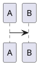

# Astro Blog Theme

Config-driven Astro blog theme for technical writing. The theme is consumed as an Astro integration and injects default pages, layouts, and styling.

## Quick Start

Scaffold a new blog in one command:

```sh
pnpm dlx @guzhongren/sha my-blog
cd my-blog && pnpm dev
```

This creates a complete project with `astro.config.mjs`, content collections bridge, and a sample post.

## Manual Setup

If you prefer to set up manually or add the theme to an existing Astro project:

```sh
pnpm add @guzhongren/sha astro @astrojs/mdx @astrojs/markdown-remark tailwindcss @tailwindcss/vite @iconify-json/ph @iconify-json/simple-icons
```

### astro.config.mjs

```js
import { defineConfig } from "astro/config";
import mdx from "@astrojs/mdx";
import tailwindcss from "@tailwindcss/vite";
import blogTheme from "@guzhongren/sha";

export default defineConfig({
  site: "https://example.com",
  integrations: [
    blogTheme({
      site: {
        name: "My Blog",
        title: "My Blog",
        description: "A blog powered by @guzhongren/sha",
        lang: "en",
      },
      author: {
        name: "Author",
      },
    }),
    mdx(),
  ],
  vite: {
    plugins: [tailwindcss()],
  },
});
```

Register `blogTheme(...)` before `mdx()` when using theme shortcodes such as ECharts. The theme pre-processes content before MDX parses it.

### Content collections bridge

```ts
// src/content.config.ts
export { collections } from "@guzhongren/sha/content";
```

Posts live in `src/content/posts`.

```md
---
title: "用 Astro 构建技术博客主题"
description: "一次从内容模型到主题集成方式的工程化拆解。"
publishDate: 2026-07-31
category: "Engineering"
tags: ["Astro", "Tailwind", "Theme"]
cover: "/covers/astro-theme.svg"
featured: true
draft: false
---
```

## Routes

The integration injects these routes by default:

- `/`
- `/posts`
- `/posts/[...slug]`

Post files can be placed directly under `src/content/posts` or nested by date, for example `src/content/posts/2024/05/12/my-post.mdx`. Nested posts are rendered at matching URLs such as `/posts/2024/05/12/my-post`.
- `/tags`
- `/tags/[tag]`
- `/categories`
- `/categories/[category]`
- `/about`
- `/search`

Set `routes: false` to disable injected pages and use the exported components manually.

## Theming and styles

The theme follows the `design.md` class-naming architecture: colors come from the built-in Tailwind palette, reusable UI patterns live in `@layer components` classes, and templates use stock utilities for local tweaks. Dark mode is class based, so `dark:` utilities follow the `.dark` class the theme toggles on `<html>`.

Accent color is configurable and is emitted as a `data-accent` attribute plus accent utility classes:

```js
blogTheme({
  theme: {
    defaultMode: "system", // "system" | "light" | "dark"
    accent: "sky", // "sky" | "teal" | "violet" | "pink"
  },
});
```

`--accent` is the only custom color property the theme exposes; it is set from a Tailwind palette token and drives decoration that class names cannot reach (focus rings, gradients, corner ticks, hover rules). Everything else is colored with Tailwind utilities.

### Fonts

The whole site — body copy, headings, code blocks, inline code, code gutters, `eyebrow` labels, tags, the avatar mark, and ECharts/Mermaid/PlantUML diagram text — renders with a self-hosted webfont: **Maple Mono CN Subset**, the GB2312 repertoire of [Maple Mono NF CN](https://github.com/subframe7536/maple-font) v8.002 (6,763 hanzi plus Latin, Greek, Cyrillic, symbol, box drawing, fullwidth and CJK punctuation), licensed under the SIL Open Font License 1.1. The license text ships in the package next to the font, and the theme leads both `--font-sans` and `--font-mono` with it, so no configuration is needed.

The subset is about 1.6 MB and browsers download it on every page, since all text uses it. Hanzi keep Maple Mono's 2:1 advance against the Latin advance, so Chinese stays on the monospace grid for prose and code alike; characters outside the subset (rare hanzi, CJK extension blocks) fall back to the system CJK font. Code ligatures (`calt`) stay enabled by default. Only the Regular weight ships, so bold headings and `<strong>` text use the browser's synthetic bold.

To use different faces, override the tokens in your own stylesheet:

```css
@theme {
  --font-sans: "Inter", ui-sans-serif, system-ui, sans-serif;
  --font-mono: "Iosevka", ui-monospace, SFMono-Regular, Menlo, monospace;
}
```

`scripts/build-font-subset.py` regenerates the bundled subset from an upstream `MapleMono-NF-CN-Regular.woff2`; it is a maintainer tool and is not part of the published package.

To restyle the theme, override Tailwind utilities in your own stylesheet or wrap the exported components. The theme no longer publishes per-color CSS variables (`--page-bg`, `--panel-bg`, `--border-soft`, `--text-*`, `--callout-*`); the equivalent selectors are `bg-white dark:bg-gray-950`, `bg-gray-950/[0.025] dark:bg-white/5`, `border-gray-950/[0.08] dark:border-white/10` and `text-gray-950 dark:text-white` / `text-gray-500 dark:text-gray-400`.

Run `pnpm run check:styles` when changing styles or templates: it enforces the architecture rules (Tailwind palette utilities, no dynamic class names, `data-*` state attributes).

## Pagination

The posts archive (`/posts`) paginates when there are more posts than `postsPerPage`. The pagination block keeps the previous/next links, adds clickable page numbers (collapsed with ellipsis when there are many pages), and marks the current page. A `Go to page` input lets readers type a page number and jump straight to it; it clamps out-of-range values and is a progressive enhancement, so the numbered links work even without JavaScript.

## Social links

Home page social links render as icon-only buttons. Configure them in `blogTheme(...)`:

```js
socialLinks: {
  github: "https://github.com/username",
  x: "https://x.com/username",
  linkedin: "https://linkedin.com/in/username",
  rss: true,
  wechat: "/qr/wechat.svg",
},
```

Each key is an `icon` value and each value is the profile URL. `rss` also accepts `true` as shorthand, which links to the theme's `/rss.xml` route automatically (when the RSS route is enabled). `wechat` takes the path to an image of your WeChat QR code; hovering the icon shows the QR code in a popup. The image keeps its aspect ratio: it is scaled up to a minimum width of 128px and scaled down to fit a maximum of 256×256px, so a square source of at least 256×256 pixels (500×500 recommended) with white margins around the code scans reliably. Supported keys cover the top 20 global social platforms (`facebook`, `youtube`, `instagram`, `whatsapp`, `tiktok`, `wechat`, `telegram`, `messenger`, `snapchat`, `reddit`, `kuaishou`, `weibo`, `qq`, `x`, `pinterest`, `linkedin`, `quora`, `discord`, `tumblr`, `threads`) plus `github`, `rss`, `mail`, and `link`. The accessible name (`aria-label` / `title`) is derived from the icon automatically, and links render in the order they appear in the object.

Because icons come from Iconify sets, projects that use social links must also install the icon sets:

```sh
pnpm add @iconify-json/simple-icons @iconify-json/ph
```

## Code blocks

Fenced code blocks render through Shiki and carry per-line numbers by default. The numbers are presentation-only: they never enter the copied text, the text layer, or the Pagefind index, and blocks that contain a single line are left unnumbered. Turn them off site-wide with:

```js
blogTheme({
  code: {
    lineNumbers: false,
  },
});
```

The gutter reserves a fixed `2ch` column plus a `0.75rem` gap, counts blank lines so numbers stay aligned with an editor, and derives its color from Shiki's own foreground color, so it stays coherent if you swap the Shiki theme. The theme writes the current state to `<html data-code-line-numbers="on|off">` if you want to restyle the gutter in your own CSS.

## Diagrams

Enable Mermaid and PlantUML from `astro.config.mjs`:

```js
blogTheme({
  diagrams: {
    mermaid: true,
    plantuml: {
      serverUrl: "https://www.plantuml.com/plantuml/svg",
    },
  },
});
```

Use normal fenced code blocks in MDX:

````md



````

Mermaid is rendered client-side from the bundled `mermaid` package with the page font stack passed through `fontFamily` and `themeVariables.fontFamily`, so diagram labels match the surrounding prose.

PlantUML is drawn by the configured PlantUML server, so the theme fetches the SVG back over CORS, strips anything executable, and inlines it with a rule that puts every label in the theme font. The public server (`https://www.plantuml.com/plantuml/svg`) sends `access-control-allow-origin: *`, so this works out of the box; a self-hosted server needs CORS enabled. When the fetch fails or the server answers with a raster image, the original `` stays and its labels keep the server's fonts (the figure reports which happened through `data-diagram-font="inline|server"`). Label geometry is preserved: `textLength` attributes from the server are kept, so boxes, arrows and text stay aligned.

## Image viewer

Images inside post content open in a full-screen viewer on click, with wheel/pinch/double-click zoom and drag/touch panning. It is enabled by default; disable it from `astro.config.mjs`:

```js
blogTheme({
  imageViewer: false,
});
```

The post cover, Mermaid/PlantUML diagrams, and images wrapped in links are left untouched.

## Link references

External `http(s)` links inside post content are numbered in document order with superscript markers, and a "参考" section is appended at the end of the article listing each link as `link text: URL`. Posts without external links get no markers and no references section. Enabled by default; disable it from `astro.config.mjs`:

```js
blogTheme({
  linkReferences: false,
});
```

Internal links, anchors, `mailto:` links, image-only links, and links inside code blocks are left untouched.

## ECharts

Use Hugo-style shortcode blocks for ECharts options:

````md

{
  "title": { "text": "折线统计图", "left": "center" },
  "xAxis": { "type": "category", "data": ["周一", "周二"] },
  "yAxis": { "type": "value" },
  "series": [{ "type": "line", "data": [120, 200] }]
}

````

The theme converts the shortcode before MDX parsing and renders the chart client-side with the bundled `echarts` package. Chart text (title, legend, axis labels, series labels) is painted into a canvas, so the theme passes the page font stack into `textStyle`; a `textStyle` you set in the options still wins, and the resolved stack is exposed as `data-chart-font` on the chart container.

## Search

The `/search` route and header search button use Pagefind full-text search. The theme builds the Pagefind index automatically after `astro build` when the search route is enabled.

Search indexes only post detail pages marked by the theme, so drafts and listing pages are excluded from results. During `astro dev`, the Pagefind bundle may not exist yet; the search page keeps a static published-post fallback.

## Analytics

Google Analytics 4 (GA4) is built in with the standard gtag.js snippet. Enable it from `astro.config.mjs`:

```js
blogTheme({
  analytics: {
    googleAnalytics: {
      id: "G-XXXXXXXXXX",
      // partytown: true (default) runs the snippet in a Web Worker via
      // @astrojs/partytown, keeping gtag.js off the main thread.
      // partytown: false falls back to the classic head snippet.
      // includeInDev: false (default) loads the snippet only in production builds.
      // config: { debug_mode: true }, // optional, passed to gtag('config', id, config)
    },
  },
});
```

When partytown is enabled, the theme registers `@astrojs/partytown` automatically and forwards `dataLayer.push`, so custom events pushed from the main thread still reach GA4. Without a `googleAnalytics` configuration, no analytics markup is rendered.

## SEO

Every build generates a sitemap (`sitemap-index.xml` and `sitemap-0.xml`) with `@astrojs/sitemap`, so search engines can discover all published pages. Sitemap generation is enabled by default and requires the `site` option in `astro.config.mjs` (already needed for RSS). To disable it:

```js
blogTheme({
  seo: {
    sitemap: false,
  },
});
```

## GitHub Pages

The CI workflow builds the `example/` app and deploys it to GitHub Pages as a project site (served under `/<repo>/`). The example config derives `site` and `base` from the `GITHUB_PAGES` and `GITHUB_REPOSITORY` environment variables, so local development keeps root-relative URLs while the Pages build outputs subpath URLs. The theme prefixes internal links and assets with the configured `base`, so navigation, search, and styling work under a subpath.

To enable the deploy:

1. Open **Settings → Pages** and set **Source** to **GitHub Actions**.
2. Push to a branch that triggers CI; the `pages` job deploys the built `example/dist`.

## V1 limits

- Single author.
- No CMS.
- No React/Vue dependency.
- No component override framework.
