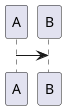

# Astro Blog Theme

Config-driven Astro blog theme for technical writing. The theme is consumed as an Astro integration and injects default pages, layouts, and styling.

## Install

```sh
pnpm add @guzhongren/sha astro @astrojs/mdx tailwindcss @tailwindcss/vite
```

## Configure

```js
// astro.config.mjs
import { defineConfig } from "astro/config";
import mdx from "@astrojs/mdx";
import tailwindcss from "@tailwindcss/vite";
import blogTheme from "@guzhongren/sha";

export default defineConfig({
  site: "https://example.com",
  integrations: [
    blogTheme({
      site: {
        name: "谷中的博客",
        description: "全栈开发者的技术写作与知识沉淀",
        lang: "zh-CN",
      },
      author: {
        name: "谷中",
        headline: "全栈开发者 / 技术顾问",
        bio: "写工程实践、架构思考、开源与日常观察。",
        avatar: "/avatar.svg",
      },
      diagrams: {
        mermaid: true,
        plantuml: {
          serverUrl: "https://www.plantuml.com/plantuml/svg",
        },
      },
    }),
    mdx(),
  ],
  vite: {
    plugins: [tailwindcss()],
  },
});
```

Register `blogTheme(...)` before `mdx()` when using theme shortcodes such as ECharts. The theme pre-processes content before MDX parses it.

## Content collections

Astro requires the app to export content collections:

```ts
// src/content.config.ts
export { collections } from "@guzhongren/sha/content";
```

Posts live in `src/content/posts`.

```md
---
title: "用 Astro 构建技术博客主题"
description: "一次从内容模型到主题集成方式的工程化拆解。"
publishDate: 2026-07-31
category: "Engineering"
tags: ["Astro", "Tailwind", "Theme"]
cover: "/covers/astro-theme.svg"
featured: true
draft: false
---
```

## Routes

The integration injects these routes by default:

- `/`
- `/posts`
- `/posts/[...slug]`

Post files can be placed directly under `src/content/posts` or nested by date, for example `src/content/posts/2024/05/12/my-post.mdx`. Nested posts are rendered at matching URLs such as `/posts/2024/05/12/my-post`.
- `/tags`
- `/tags/[tag]`
- `/categories`
- `/categories/[category]`
- `/about`
- `/search`

Set `routes: false` to disable injected pages and use the exported components manually.

## Diagrams

Enable Mermaid and PlantUML from `astro.config.mjs`:

```js
blogTheme({
  diagrams: {
    mermaid: true,
    plantuml: {
      serverUrl: "https://www.plantuml.com/plantuml/svg",
    },
  },
});
```

Use normal fenced code blocks in MDX:

````md



````

Mermaid is rendered client-side from the bundled `mermaid` package. PlantUML is rendered as an image using the configured PlantUML server.

## ECharts

Use Hugo-style shortcode blocks for ECharts options:

````md

{
  "title": { "text": "折线统计图", "left": "center" },
  "xAxis": { "type": "category", "data": ["周一", "周二"] },
  "yAxis": { "type": "value" },
  "series": [{ "type": "line", "data": [120, 200] }]
}

````

The theme converts the shortcode before MDX parsing and renders the chart client-side with the bundled `echarts` package.

## Search

The `/search` route and header search button use Pagefind full-text search. The theme builds the Pagefind index automatically after `astro build` when the search route is enabled.

Search indexes only post detail pages marked by the theme, so drafts and listing pages are excluded from results. During `astro dev`, the Pagefind bundle may not exist yet; the search page keeps a static published-post fallback.

## V1 limits

- Single author.
- No CMS.
- No React/Vue dependency.
- No component override framework.
