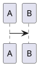

# Astro Blog Theme

Config-driven Astro blog theme for technical writing. The theme is consumed as an Astro integration and injects default pages, layouts, and styling.

## Quick Start

Scaffold a new blog in one command:

```sh
pnpm dlx @guzhongren/sha my-blog
cd my-blog && pnpm dev
```

This creates a complete project with `astro.config.mjs`, content collections bridge, and a sample post.

## Manual Setup

If you prefer to set up manually or add the theme to an existing Astro project:

```sh
pnpm add @guzhongren/sha astro @astrojs/mdx @astrojs/markdown-remark tailwindcss @tailwindcss/vite @iconify-json/ph @iconify-json/simple-icons
```

### astro.config.mjs

```js
import { defineConfig } from "astro/config";
import mdx from "@astrojs/mdx";
import tailwindcss from "@tailwindcss/vite";
import blogTheme from "@guzhongren/sha";

export default defineConfig({
  site: "https://example.com",
  integrations: [
    blogTheme({
      site: {
        name: "My Blog",
        title: "My Blog",
        description: "A blog powered by @guzhongren/sha",
        lang: "en",
      },
      author: {
        name: "Author",
      },
    }),
    mdx(),
  ],
  vite: {
    plugins: [tailwindcss()],
  },
});
```

Register `blogTheme(...)` before `mdx()` when using theme shortcodes such as ECharts. The theme pre-processes content before MDX parses it.

### Content collections bridge

```ts
// src/content.config.ts
export { collections } from "@guzhongren/sha/content";
```

Posts live in `src/content/posts`.

```md
---
title: "用 Astro 构建技术博客主题"
description: "一次从内容模型到主题集成方式的工程化拆解。"
publishDate: 2026-07-31
category: "Engineering"
tags: ["Astro", "Tailwind", "Theme"]
cover: "/covers/astro-theme.svg"
featured: true
draft: false
---
```

## Routes

The integration injects these routes by default:

- `/`
- `/posts`
- `/posts/[...slug]`

Post files can be placed directly under `src/content/posts` or nested by date, for example `src/content/posts/2024/05/12/my-post.mdx`. Nested posts are rendered at matching URLs such as `/posts/2024/05/12/my-post`.
- `/tags`
- `/tags/[tag]`
- `/categories`
- `/categories/[category]`
- `/about`
- `/search`

Set `routes: false` to disable injected pages and use the exported components manually.

## Social links

Home page social links render as icon-only buttons. Configure them in `blogTheme(...)`:

```js
socialLinks: {
  github: "https://github.com/username",
  x: "https://x.com/username",
  linkedin: "https://linkedin.com/in/username",
  rss: true,
  wechat: "/qr/wechat.svg",
},
```

Each key is an `icon` value and each value is the profile URL. `rss` also accepts `true` as shorthand, which links to the theme's `/rss.xml` route automatically (when the RSS route is enabled). `wechat` takes the path to an image of your WeChat QR code; hovering the icon shows the QR code in a popup. The image keeps its aspect ratio: it is scaled up to a minimum width of 128px and scaled down to fit a maximum of 256×256px, so a square source of at least 256×256 pixels (500×500 recommended) with white margins around the code scans reliably. Supported keys cover the top 20 global social platforms (`facebook`, `youtube`, `instagram`, `whatsapp`, `tiktok`, `wechat`, `telegram`, `messenger`, `snapchat`, `reddit`, `kuaishou`, `weibo`, `qq`, `x`, `pinterest`, `linkedin`, `quora`, `discord`, `tumblr`, `threads`) plus `github`, `rss`, `mail`, and `link`. The accessible name (`aria-label` / `title`) is derived from the icon automatically, and links render in the order they appear in the object.

Because icons come from Iconify sets, projects that use social links must also install the icon sets:

```sh
pnpm add @iconify-json/simple-icons @iconify-json/ph
```

## Diagrams

Enable Mermaid and PlantUML from `astro.config.mjs`:

```js
blogTheme({
  diagrams: {
    mermaid: true,
    plantuml: {
      serverUrl: "https://www.plantuml.com/plantuml/svg",
    },
  },
});
```

Use normal fenced code blocks in MDX:

````md



````

Mermaid is rendered client-side from the bundled `mermaid` package. PlantUML is rendered as an image using the configured PlantUML server.

## ECharts

Use Hugo-style shortcode blocks for ECharts options:

````md

{
  "title": { "text": "折线统计图", "left": "center" },
  "xAxis": { "type": "category", "data": ["周一", "周二"] },
  "yAxis": { "type": "value" },
  "series": [{ "type": "line", "data": [120, 200] }]
}

````

The theme converts the shortcode before MDX parsing and renders the chart client-side with the bundled `echarts` package.

## Search

The `/search` route and header search button use Pagefind full-text search. The theme builds the Pagefind index automatically after `astro build` when the search route is enabled.

Search indexes only post detail pages marked by the theme, so drafts and listing pages are excluded from results. During `astro dev`, the Pagefind bundle may not exist yet; the search page keeps a static published-post fallback.

## Analytics

Google Analytics 4 (GA4) is built in with the standard gtag.js snippet. Enable it from `astro.config.mjs`:

```js
blogTheme({
  analytics: {
    googleAnalytics: {
      id: "G-XXXXXXXXXX",
      // partytown: true (default) runs the snippet in a Web Worker via
      // @astrojs/partytown, keeping gtag.js off the main thread.
      // partytown: false falls back to the classic head snippet.
      // includeInDev: false (default) loads the snippet only in production builds.
      // config: { debug_mode: true }, // optional, passed to gtag('config', id, config)
    },
  },
});
```

When partytown is enabled, the theme registers `@astrojs/partytown` automatically and forwards `dataLayer.push`, so custom events pushed from the main thread still reach GA4. Without a `googleAnalytics` configuration, no analytics markup is rendered.

## SEO

Every build generates a sitemap (`sitemap-index.xml` and `sitemap-0.xml`) with `@astrojs/sitemap`, so search engines can discover all published pages. Sitemap generation is enabled by default and requires the `site` option in `astro.config.mjs` (already needed for RSS). To disable it:

```js
blogTheme({
  seo: {
    sitemap: false,
  },
});
```

## GitHub Pages

The CI workflow builds the `example/` app and deploys it to GitHub Pages as a project site (served under `/<repo>/`). The example config derives `site` and `base` from the `GITHUB_PAGES` and `GITHUB_REPOSITORY` environment variables, so local development keeps root-relative URLs while the Pages build outputs subpath URLs. The theme prefixes internal links and assets with the configured `base`, so navigation, search, and styling work under a subpath.

To enable the deploy:

1. Open **Settings → Pages** and set **Source** to **GitHub Actions**.
2. Push to a branch that triggers CI; the `pages` job deploys the built `example/dist`.

## V1 limits

- Single author.
- No CMS.
- No React/Vue dependency.
- No component override framework.
