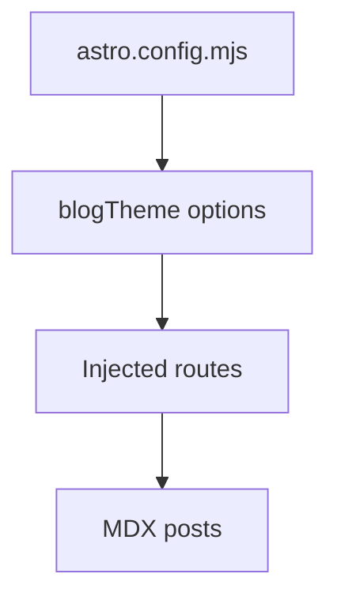
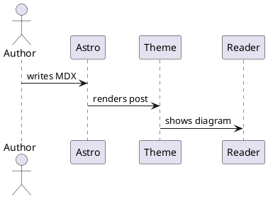

## 为什么做成 integration

主题配置应该靠近 `astro.config.mjs`，因为使用者接入主题时最先打开的就是 Astro 配置文件。

```js
import blogTheme from "@your-scope/astro-blog-theme";

export default {
  integrations: [
    blogTheme({
      site: { name: "谷中的博客" },
    }),
  ],
};
```

## 内容仍然留给 content collections

文章是内容，不是主题配置。主题只提供 schema 和默认页面，用户继续把 Markdown 或 MDX 放在 `src/content/posts`。

## Mermaid 图表示例



## PlantUML 图表示例



## v1 不做什么

先不做 CMS、多作者、全文搜索和组件 override。一个可运行、可理解的主题比一个还没用上就复杂的框架更有价值。
